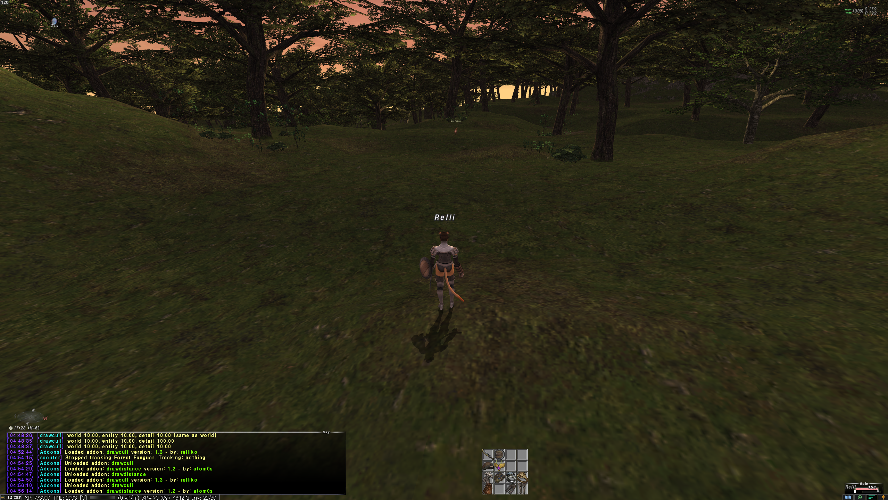
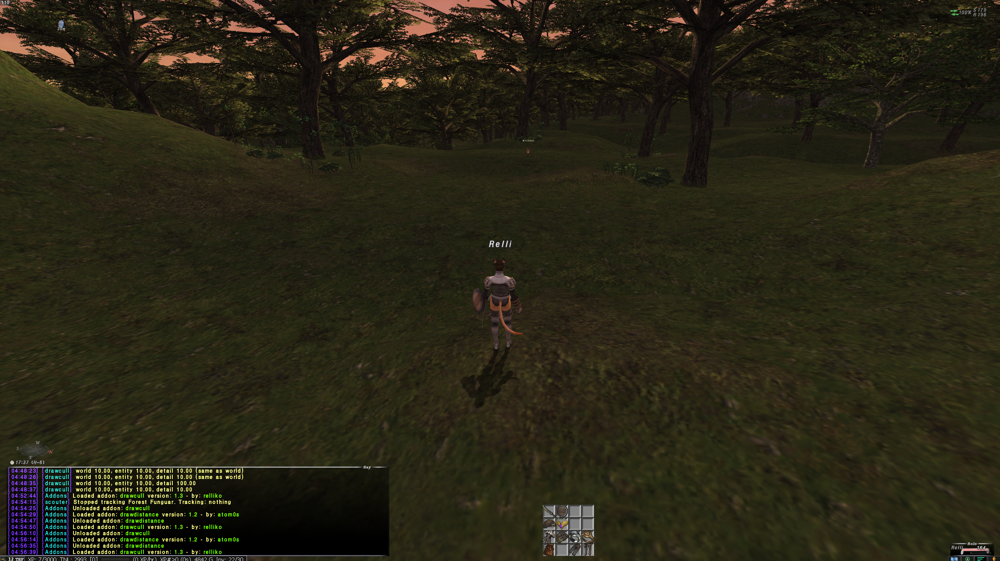

# drawcull

Ashita v4 addon that raises Final Fantasy XI's draw distance without zone objects popping in or dropping detail early. It replaces the stock `drawdistance` addon (unload that one first).

> Check your server's rules on client modifications before using it.

Same spot in West Ronfaure, both at a world draw distance of 10. With drawdistance, the hills past the trees aren't drawn and the sky shows through the gap until you walk closer. With drawcull, the whole hillside is there.

| drawdistance 1.2 | drawcull 1.3 |
| --- | --- |
|  |  |

## How it works

- **Draw distance.** The client multiplies its far clip, fog and entity cull distance by a world and an entity multiplier (1.0 stock). These are the same values `drawdistance` writes. drawcull sets them, saves them per character, and sets them back to 1.0 on unload.
- **Object pop-in.** Zone objects with their own view range (buildings, trees, props) are culled with `distance² > scale × range²`. The world multiplier is applied to a squared distance, so a multiplier of 10 only pushes those objects out about 3.2x (√10) while the far clip and fog move 10x. drawcull points the call that computes that per-frame scale at a stub that multiplies it by the world multiplier once more, so object ranges grow by the full multiplier.
- **Detail (LOD).** Each zone object has three meshes and picks one by comparing its squared distance against two fixed thresholds that nothing scales, so trees change shape at the same distance however far you draw. drawcull replaces the four compares with stubs that scale the distance by 1 / detail², which moves both switch points out by the detail multiplier.
- **Distant terrain.** Zones carry precomputed lists of which objects can be seen from each area, and while the camera's area has one, only those objects are drawn. Terrain the zone didn't expect you to see is never drawn, however far the draw distance goes, and pops in when you cross into the next area. With `vis` on (the default), drawcull makes the renderer skip those lists and fall back to its quadtree walk, which culls by view frustum and distance only.

The extra cost is GPU work only (expect lower fps with `vis` on): the zone geometry is already loaded, so drawing more of it doesn't add memory use. Unloading restores every patched byte.

## Install

Copy `drawcull.lua` to `<Ashita>\addons\drawcull\drawcull.lua`, then run `/addon load drawcull`.

## Commands

| Command | Effect |
| --- | --- |
| `/drawcull` | Show the current values. |
| `/drawcull world <n>` | World draw distance multiplier (terrain, objects, fog). 1 = stock. |
| `/drawcull entity <n>` | Entity draw distance multiplier (players, NPCs, mobs). 1 = stock. The server only sends entities within about 50 yalms. |
| `/drawcull detail <n>` | How much further objects keep their detailed mesh. 0 (default) follows the world value. |
| `/drawcull vis <on\|off>` | `on` (default): draw distant terrain the zone would hide from your area. `off`: stock. |
